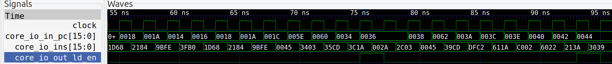

# The Completely F***ing Useless Processor (CFU)
The Completely F'ing Useless processor (**CFU** for short) is, for all intents and purposes, a completely f***ing useless processor and ISA designed completely from scratch. The CFU processor and its ISA are inspired by the RISC-V ISA and take many design cues from the [RISC-V Mini](https://github.com/ucb-bar/riscv-mini) project. The point of this project is completely pedagogical - a way to fundimentally learn how to build a processor, ISA, and toolchain, and OS for some from of real-world use.

# How to build
In order to build the Processor and simulate it, run the following commands:
```
# Builds all required source into a build/ folder to run the CPU
make
```

```
# Will load and run the default program (with verbosity)
./build/VCFU -v
```
Prints:
```
R: Mem[0x0C] 0xEC07     W: En: Yes mem[0]: 42
```

## Advanced features
I've built this to allow for more advance debugging features such as simulated trace via gtkwave (.vcd file) and printing out instructions per cycle. You can also load your own compiled program as a .bin

```
# Compile the example loop program
make examples/subroutine
```
```
./build/VCFU -t build/subroutine.vcd -vv -b build/subroutine.bin
```
`-t` creates a trace file for debugging
`-b` loads in a binary
`-v` verbose output that prints instructions

Output:
```
...
R: Mem[0x22] 0x0045     W: En: Yes mem[0]: 42
R: Mem[0x3C] 0xA9CD     W: En:  No mem[0]: 0
R: Mem[0x24] 0xDFC2     W: En:  No mem[0]: 0
R: Mem[0x26] 0x611A     W: En:  No mem[0]: 42
R: Mem[0x28] 0xC002     W: En:  No mem[0]: 0
R: Mem[0x2A] 0x6022     W: En:  No mem[0]: 0
R: Mem[0x2C] 0x213A     W: En:  No mem[0]: 0
R: Mem[0x10] 0x3039     W: En:  No mem[16]: 0
R: Mem[0x2E] 0x3CC3     W: En:  No mem[16]: 16
R: Mem[0x30] 0x0045     W: En: Yes mem[33023]: 12345
R: Mem[0x3E] 0xE007     W: En:  No mem[0]: 0
```
> Debug the trace file by running `gtkwave`
```
gtkwave build/subroutine.vcd
```


# CFU ISA
Its useful to break down an ISA into its component parts: arithmatic, load/store, branch, and CSR. I think the 8-bit CPU is too limiting for this project because you have no overhead to do anything significant. I think I'd rather change the architecture to a limited 16-bit architecture so that I don't need to deal with the complexities of fitting everything into such a small space.

I want to put all opcodes into a 3-bit space and then the different types of can be organized accordingly.

The instructions should read in destination, source order (Intel syntax).

The register stucture will be simular to RISC-V with a zero register and the PC as its own register. The register map will look like this:

|Register|Register Name|Desciption|
|-|-|-|
|x0|zero|This register is read only and only returns zero|
|x1|ra|Return address register|
|x2|sp|Stack pointer register|
|x3|t0|Temporary Storage 0|
|x4|t1|Temporary Storage 1|
|x5|s0|Saved Register 0|
|x6|a0|General purpose or for passing valiables into a function|
|x7|a1|General purpose or for passing valiables into a function|

|Register|Register Name|Desciption|
|-|-|-|
|pc|pc|Program Counter|

I think this will be a nice, simple way for the processor to be mildly useful.

## CFU ISA Overview
|Instruction|Type|funct3 (3b)|src1 (3b)|func1 (1b)|src0 (3b)|dst (3b)|Opcode (3b)|
|:-:|:-:|:-:|:-:|:-:|:-:|:-:|:-:|
|**ADD**|R|`0x0`|src1|`N/A`|src0|dst|`0x0`|
|**ADDI**|I|`0x1`|imm[`3:1`]|imm[`0`]|src0|dst|`0x0`|
|**SUB**|R|`0x2`|src1|`N/A`|src0|dst|`0x0`|
|**AND**|R|`0x0`|src1|`N/A`|src0|dst|`0x1`|
|**OR**|R|`0x1`|src1|`N/A`|src0|dst|`0x1`|
|**XOR**|R|`0x2`|src1|`N/A`|src0|dst|`0x1`|
|**NOT**|R|`0x3`|`N/A`|`N/A`|src0|dst|`0x1`|
|**SLL**|R|`0x4`|src1|`N/A`|src0|dst|`0x1`|
|**SLLI**|I|`0x5`|imm[`3:1`]|imm[`0`]|src0|dst|`0x1`|
|**SRL**|R|`0x6`|src1|`N/A`|src0|dst|`0x1`|
|**SRLI**|I|`0x7`|imm[`3:1`]|imm[`0`]|src0|dst|`0x1`|
|LB|I|imm[`4`], `0x0`|imm[`3:1`]|imm[`0`]|src0|dst|`0x2`|
|**LW**|I|imm[`4`], `0x1`|imm[`3:1`]|imm[`0`]|src0|dst|`0x2`|
|**LLI**|UU|imm[`4`], `0x2`|imm[`3:1`]|imm[`0`]|imm[`7:5`]|`N/A`|`0x2`|
|**LUAI**|UUU|imm[`4`], `0x3`|imm[`3:1`]|imm[`0`]|imm[`7:5`]|dst|`0x2`|
|SB|S|imm[`4`], `0x0`|src1|imm[`0`]|src0|imm[`3:1`]|`0x3`|
|**SW**|S|imm[`4`], `0x1`|src1|imm[`0`]|src0|imm[`3:1`]|`0x3`|
|**EQ**|C|`0x0`|src1|`N/A`|src0|`N/A`|`0x4`|
|**NEQ**|C|`0x1`|src1|`N/A`|src0|`N/A`|`0x4`|
|**GE**|C|`0x2`|src1|`N/A`|src0|`N/A`|`0x4`|
|**GEU**|C|`0x3`|src1|`N/A`|src0|`N/A`|`0x4`|
|**LT**|C|`0x4`|src1|`N/A`|src0|`N/A`|`0x4`|
|**LTU**|C|`0x5`|src1|`N/A`|src0|`N/A`|`0x4`|
|**JALR**|I|imm[`4`], `0x0`|imm[`3:1`]|imm[`0`]|src0|dst|`0x5`|
|**JAL**|U|imm[`4`], `0x1`|imm[`3:1`]|imm[`0`]|imm[`7:5`]|dst|`0x5`|
|**BR**|B|imm[`4`], `0x0`|imm[`3:1`]|imm[`0`]|imm[`7:5`]|imm[`10:8`]|`0x6`|
|**HLT**|R|`0x7`|`N/A`|`N/A`|`N/A`|`N/A`|`0x7`|

# CFU ISA Assembly
I've created a super simple assembly parser to create and link machine code. It only has a few features but should be pretty easy to use.

Comments are `//`'s

|Section|Description|
|-|-|
|`.data`|Data to be writen into static memory in the program|
|`.text`|All of the instructions for the program|

## Data Section
The data section is marked by `.data` and all valid items between `.data` either the end of the file or end of the section are treated as data. For example:
```
// Data Section
.data

// String data named 'msg'
msg:
    .string "Hello\n"

// Int data named 'life'
life:
    .word 42
```

### Supported Types
|Types|Description|
|-|-|
|`.string`|String, will get converted into byte aligned, null terminated string|
|`.word`|16-bit word|

## Text Section
The data section is marked by `.text` and all valid items between `.text` either the end of the file or end of the section are treated as text.

For example, a single file:
```
// Text Section Start
.text

// Subroutine start
soft_mul:
    add     s0, x0, x0      // initialize s0 to 0 for return value
    addi    a0, a0, -1      // decrement a0
    add     s0, s0, a1      // accumulate s0 by a1
    neq     a0, x0          // x1 != 0
    br      -3              // branch if true
    jalr    x0, 0(ra)       // unconditional jump back to return address
```

For example, a main file:
```
.text
    entry _start

...

_start:
    lw      a1, life       // load data 'life' from memory
    addi    a0, x0, 7      // set a0 to 7
    jal     ra, soft_mul   // jump to soft_mul and store return address in ra
    sw      x0, 0(s0)      // store the answer from s0 to answer
    jal     ra, output_42  // jump to output_42 and store return address in ra
    jal     ra, store_far  // jump to store_far and store return address in ra
    hlt     x0, x0, x0
```

As you can see in the examples above, both data items and subroutines can be placed into the assembly. The linker will search and replace data/subroutines with their associated memory address.
> **IMPORTANT:** the linker cannot resolve memory addresses that haven't been set yet. Therefore, order of .asm files is critical for dependencies.

### Special Symbols
|Symbol|Description|
|-|-|
|`entry`|Tells the linker what function to jump to on start|

All compiled programs must have 1 `entry` symbol for the entry location. On start, the program will jump to where ever the entry program is.

# Appendix
## Switch between 32-bit and 16-bit
There isn't much that needs to be done to switch between 32-bit and 16-bit:

In `src/main/scala/cfu/config/Parameters.scala`:
```scala
// This tells the generator to use X bit registers
object Config {
     /* Parameters */
     def REGFILE_SIZE     = 8
-    def ARCH_SIZE        = 16 // remove
+    def ARCH_SIZE        = 32 // add
     def INS_SIZE         = 16
     def WORD_SIZE        = ARCH_SIZE
 }
```

In `src/main/cpp/main.cpp`:
```cpp
     // Initialize as an uint32_t instead of uint16_t
     /* Initialize Memory */
-    Memory<uint16_t> memory(1024); // remove
+    Memory<uint32_t> memory(1024); // add
```

In `tools/compiler.py`:
```py
# packs data into 32-bit values instead of 16-bit values
class WordDataItem(DataItem):
     def toBytes(self):
-        return array.array('B', struct.pack('<H', int(self._value))) # remove
+        return array.array('B', struct.pack('<I', int(self._value))) # add
```