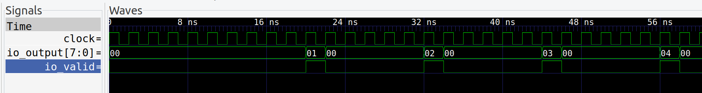

# Chisel Project Template
8-bit von Neumann CPU inspired by the Ben Eater ISA. The point of this project is to create an 8-bit computer for learning how to build a computer from scratch based on my current understanding of computer architecture.

# How to build (__deprecated__)
In order to build the CPU and simulate it, run the following commands:
```
# Builds all required source into a build/ folder to run the CPU
make
```

```
# Will load and run the default program
./build/VCPU
```
Prints:
> We got an output! out: 42

## Advanced features
I've built this to allow for more advance debugging features such as simulated trace via gtkwave (.vcd file) and printing out instructions per cycle. You can also load your own compiled program as a .bin

```
# Compile the example loop program
make examples/loop
```
```
./build/VCPU -t build/loop.vcd -b build/loop.bin -v
```
`-t` creates a trace file for debugging
`-b` loads in a binary
`-v` verbose output that prints instructions per clock

Output:
```
We got an output! out: 0
Out[6]: ins 0x61 res 0
Out[1]: ins 0x 0 res 0
Out[2]: ins 0x51 res 0
Out[3]: ins 0x20 res 0
Out[4]: ins 0x40 res 0
Out[5]: ins 0xE0 res 1
We got an output! out: 1
Out[6]: ins 0x61 res 0
Out[1]: ins 0x 0 res 0
Out[2]: ins 0x51 res 0
Out[3]: ins 0x20 res 0
Out[4]: ins 0x40 res 0
Out[5]: ins 0xE0 res 2
We got an output! out: 2
Out[6]: ins 0x61 res 0
Out[1]: ins 0x 0 res 0
```
> Debug the trace file by running `gtkwave`
```
gtkwave build/loop.vcd
```


# ISA 1.0 (Ben Eater)

|INS|Desciption|Op Code|Mem Address|
|-|-|-|-|
|NOP|No Operation|0b0000|0bXXXX|
|LDA|Load from address into A register|0b0001|4-bit address|
|ADD|Add A and B register, store in A|0b0010|4-bit address|
|SUB|Subtract A and B register, store in A|0b0011|4-bit address|
|STA|Store A register into memory|0b0100|4-bit address|
|LDI|Load immediate into A register|0b0101|4-bit value|
|JMP|Jump to program address|0b0110|4-bit address|
|JC|Jump to if carry is set|0b0111|4-bit address|
|JZ|Jump to if sum is zero|0b1000|4-bit address|
|OUT|Displays contents of A register|0b1110|0bXXXX|
|HLT|Halts processor|0b1111|0bXXXX|

# ISA 2.0

|INS|Desciption|Op Code|Mem Address|
|-|-|-|-|
|ADD|Add A and B register, store in A|0b0000|0b0XXX|
|SUB|Subtract A and B register, store in A|0b0000|0b1XXX|
|LDA|Load from address into A register|0b0001|4-bit address lower|
|LDAH|Load from address into A register|0b0010|4-bit address upper|
|LDB|Load from address into B register|0b0011|4-bit address lower|
|LDBH|Load from address into B register|0b0100|4-bit address upper|
|LDI|Load immediate into A register|0b0101|4-bit value lower|
|LDIH|Load from immediate into A register|0b0110|4-bit value upper|
|STA|Store contents in A to address stored in B|0b0111|0bXXXX|
|JMP|Jump to address in A register|0b1000|0bXXXX|
|JSR|Jump to Subroutine at address in A register|0b1001|0b0XXX|
|RSR|Return from Subroutine at address in A register|0b1001|0b1XXX|
|BZ|Branch to relative, unsigned address if result of reg A and reg B is zero|0b1010|4-bit unsigned relative address|
|CLR|Clear processor flags|0b1011|0b0XXX|
|FLG|Copy processor flags to reg A|0b1011|0b1XXX|
|HLT|Halts processor|0b1111|0bXXXX|

## Arithmatic Operations
`ADD`, `SUB`: Add or subtract signed integers

## Load/Store
`LDI`, `LDIH`: Load immediate into register A

`LDA`, `LDAH`: Load from address into register A

`LDB`, `LDBH`: Load from address into register B

`STA`: Store register A into address at register B

## Branch/Jmp
`JMP`: unconditional jump to address loaded in register A

`JSR`: jump to subroutine at address loaded in register A

`RSR`: return from subroutine

`BZ`: branch to an address relative to the current PC

## CSR
`CLR`: clear processor flags

`FLG`: copy processor flags into reg A

`HLT`: halt the processor

# Components
# ALU
The ALU needs to take in two inputs (A and B registers) and multiplex control inputs. The ALU will be able to add or subtract either signed or unsigned integers. The ALU will output the result, a bit for carry, and a bit for zero.

|Requirement|Desciption|Complete|
|-|-|-|
|Unsigned Addition|The ALU shall implement unsigned addition|Complete|
|Zero Result Bit|The ALU shall output a zero bit from the result if the result of the addition or subtraction is 0|Complete|
|Carry Result Bit|The ALU shall output a carry/borrow bit if there was an overflow as a result of the operation|Complete|